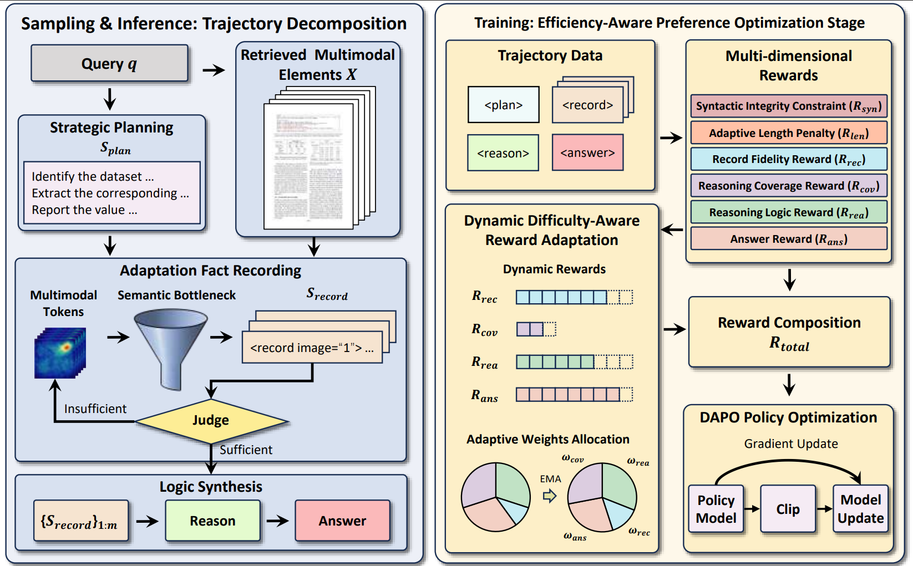

# <div align="center">Adaptive Fact-Driven Reasoning for Efficient Multimodal Document Retrieval-Augmented Generation</div>

<div align="center">
<p><strong></strong></p>
<br>
<a href="https://huggingface.co/nnroc/AdaFact-3B" target="_blank"></a>
<a href="https://huggingface.co/nnroc/AdaFact-Train" target="_blank"></a>
</div>

---

<div align="center">
<p align="center">
  
</p>
</div>

---

Note: some data and content will be disclosed after acceptance.

# 📖 Introduction

# ⚙️ Dependencies
```
git clone https://github.com/nnroc/AdaFact.git
conda create -n AdaFact python==3.12
conda activate AdaFact
pip install -r requirements.txt
```

# Training
## SFT
Ensure the LLaMA-Factory environment is properly installed and activated based on [LLaMA-Factory](https://github.com/hiyouga/LLaMA-Factory).
```
bash script/sft_3b.sh
```

## RL
Ensure the verl environment is properly installed and activated based on [verl](https://github.com/volcengine/verl).
```
cd verl-0.6.1
bash script/rl_dataset.sh
bash script/rl_3b.sh
```

Notes:
1. The training data is available on Hugging Face under `AdaFact-Train`, which is referenced at the beginning of this page.
2. We adopt a two-stage training strategy. In the first stage, please clone `LLaMA-Factory` and update the model path in the sft_3b.sh script. In the second stage, we built our customized algorithm based on `verl`, specifically designed for AdaFact, whose implementation can be found in `./verl-0.6.1`.

# Evaluation
## Index
```
bash script/index.sh
```

## Retrieve
```
bash script/retrieve.sh
```

## Answer
```
bash script/answer.sh
```
